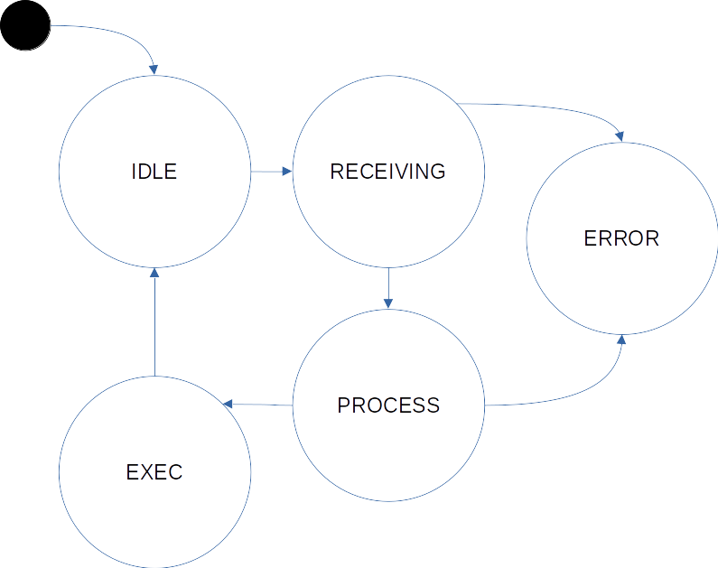

Author: Sebastian Tleye

# Práctica 5 — UART y parser de comandos con MEF

## Objetivo

Implementar un módulo de software para utilizar la UART y una MEF para parsear comandos recibidos por UART en modo polling (sin interrupciones ni DMA) usando la HAL de STM32 (STM32F4 + STM32CubeIDE).

En el Punto 1 se crea la capa de acceso a la UART.

En el Punto 2 (progresivo) se implementa un parser de comandos muy sencillo mediante una MEF.

## Punto 1

Implementar un módulo de software en un archivo fuente `API_uart.c` con su correspondiente archivo de cabecera `API_uart.h` y ubicarlos en el proyecto dentro de las carpetas `/API/src` y `/API/inc`, respectivamente.

En `API_uart.h` se deben ubicar los prototipos de las funciones públicas.

```c
bool_t uartInit();
void uartSendString(uint8_t * pstring);
void uartSendStringSize(uint8_t * pstring, uint16_t size);
void uartReceiveStringSize(uint8_t * pstring, uint16_t size);
```

En `API_uart.c` se deben ubicar los prototipos de las funciones privadas y la implementación de todas las funciones del módulo, privadas y públicas.

### Consideraciones para la implementación

1. `uartInit()` debe realizar toda la inicialización de la UART. Adicionalmente, debe imprimir por la terminal serie un mensaje con sus parámetros de configuración.

   La función devuelve:
   - `true`: si la inicialización es exitosa.
   - `false`: si la inicialización no es exitosa.

2. `uartSendString(uint8_t *pstring)` recibe un puntero a un string que se desea enviar por la UART completo (hasta el caracter `'\0'`) y debe utilizar la función de la HAL `HAL_UART_Transmit(...)` para transmitir el string.

3. `uartSendStringSize(uint8_t * pstring, uint16_t size)` recibe un puntero a un string que se desea enviar por la UART y un entero con la cantidad de caracteres que debe enviar. La función debe utilizar `HAL_UART_Transmit(...)` para transmitir el string.

### Reglas obligatorias de implementación

- Todas las funciones deben validar sus parámetros:
  - Punteros ≠ `NULL`
  - `size` entre 1 y 256 (valor razonable que se puede ajustar).
- Siempre verificar el valor de retorno de cada función HAL que se use (`HAL_OK`, `HAL_ERROR`, etc.).
- Usar variables `static` dentro del módulo cuando sea necesario (no exponer variables globales).

## Punto 2 — Parser de comandos con MEF simple (progresivo)

Implementar un módulo de software (`API_cmdparser`) que permita recibir comandos por UART en modo polling mediante una Máquina de Estados Finita (MEF). El parser deberá leer caracteres, formar líneas completas, validar comandos básicos y ejecutar las acciones correspondientes sin bloquear el programa principal.

Crear los archivos:

- `API/inc/API_cmdparser.h`
- `API/src/API_cmdparser.c`

### Definiciones (en `API_cmdparser.h`)

```c
#define CMD_MAX_LINE    64      // incluye '\0'
#define CMD_MAX_TOKENS  3       // COMANDO + máximo 2 argumentos

typedef enum {
    CMD_OK = 0,
    CMD_ERR_OVERFLOW,
    CMD_ERR_SYNTAX,
    CMD_ERR_UNKNOWN,
    CMD_ERR_ARG
} cmd_status_t;
```

### Prototipos de funciones públicas

```c
/**
 * @brief  Inicializa el módulo parser de comandos
 */
void cmdParserInit(void);

/**
 * @brief  Máquina de estados del parser. Debe ser llamada periódicamente desde el bucle
 *         Procesa hasta 16 bytes por invocación (no bloqueante).
 */
void cmdPoll(void);

/**
 * @brief  Imprime por UART la lista de comandos disponibles
 */
void cmdPrintHelp(void);
```

### Estados de la MEF (solo 5 estados)

| Estado | Qué hace | Transición a |
|---|---|---|
| `CMD_IDLE` | Espera primer carácter no-terminador | `CMD_RECEIVING` |
| `CMD_RECEIVING` | Acumula caracteres en buffer | `CMD_PROCESS` (al recibir `\r` o `\n`) o `CMD_ERROR` |
| `CMD_PROCESS` | Tokeniza, valida comando y argumentos | `CMD_EXEC` o `CMD_ERROR` |
| `CMD_EXEC` | Ejecuta la acción y vuelve a `CMD_IDLE` | `CMD_IDLE` |
| `CMD_ERROR` | Imprime mensaje de error y vuelve a `CMD_IDLE` | `CMD_IDLE` |



### Progresión del Punto 2 (obligatorio hasta 2.3)

#### 2.1 — Eco básico (obligatorio, para familiarizarse)

Implementar solo que cada carácter recibido se envíe de vuelta inmediatamente (echo).

Usar `uartReceiveStringSize()` con `size = 1`.

Objetivo: comprobar que la UART funciona en polling.

#### 2.2 — Recepción de línea completa (obligatorio)

- Acumular caracteres en un buffer hasta recibir `\r`, `\n` o `\r\n`.
- Ignorar líneas que empiecen con `#` o `//` (comentarios).
- Al recibir terminador → llamar a `cmdProcessLine()` (función privada).
- Si el buffer se llena → error `CMD_ERR_OVERFLOW`.

#### 2.3 — MEF completa con comandos mínimos (obligatorio)

Comandos obligatorios (case-insensitive):

- `HELP` → imprime lista de comandos disponibles.
- `LED ON` / `LED OFF` / `LED TOGGLE` → enciende, apaga o conmuta el LED (usar la función que ya tengan del práctico anterior).
- `STATUS` → imprime `LED is ON/OFF`.

#### 2.4 — Comandos avanzados (opcional)

Agregar:

- `BAUD?` → muestra baudrate actual.
- `BAUD=115200` (rango 9600 a 921600) → cambia el baudrate y reinicia la UART.

### Reglas de protocolo

- La línea termina con `\r\n`, `\n` o `\r`.
- Múltiples espacios o tabs se ignoran.
- Las respuestas siempre terminan con `\r\n`.
- Mensajes de error claros:
  - `ERROR: line too long\r\n`
  - `ERROR: unknown command\r\n`
  - `ERROR: bad arguments\r\n`

### Cómo implementar la MEF (guía para alumnos con poca experiencia)

En `API_cmdparser.c` tendrán un `typedef enum { ... } cmd_state_t;` y una variable `static cmd_state_t state = CMD_IDLE;`.

Dentro de `cmdPoll()`:

```c
void cmdPoll(void) {
    uint8_t c;
    // leer 1 byte (o hasta 16 si quieren optimizar)
    if (HAL_UART_Receive(...) == HAL_OK) {
        switch (state) {
            case CMD_IDLE:
                if (c != '\r' && c != '\n') state = CMD_RECEIVING;
                break;
            // ... resto de la máquina
        }
    }
}
```

Se recomienda que los alumnos primero dibujen en papel la MEF con 5 estados y luego codifiquen.

## Recomendaciones generales para la práctica

1. En `main.c` solo llamar a `uartInit()`, `cmdPoll()` y la lógica de LED en el bucle infinito.
2. No modificar los archivos generados por CubeMX (mantener separación clara).
3. Usar `static` para todo lo interno de los módulos API.
4. Comentar profusamente la MEF (cada estado y transición).
